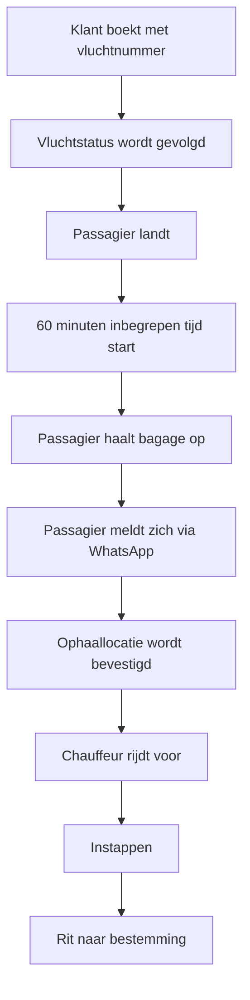

# Klantreis — ophalen op de luchthaven

**Laatst bijgewerkt:** 20 juli 2026

Deze reis beschrijft wat het systeem en de operatie **kunnen waarmaken**. Waar een
stap afhangt van een onbevestigd gegeven, staat dat erbij.

---

## De reis

---

## Waarom niet "chauffeur staat te wachten"

De voor de hand liggende reis zou zijn:

> landing → chauffeur staat klaar → passagier stapt in

Die reis is **niet gemodelleerd**, om één reden: het is onbevestigd of een vooraf
geboekte taxi op de aangewezen locatie mág wachten. Zolang dat niet schriftelijk
vaststaat, kan het systeem er geen belofte omheen bouwen.

De gemodelleerde reis werkt in beide gevallen. Mag de chauffeur wachten, dan staat
hij er al wanneer de passagier zich meldt. Mag het niet, dan wacht hij elders en
rijdt hij voor na het bericht. **De klant merkt hetzelfde; de kosten verschillen.**

Zie `docs/risk/airport-risk-register.md`, risico A2.

---

## Wie doet wat

| Stap | Systeem | Mens |
|---|---|---|
| Boeking | Vluchtnummer verplicht, richting afgeleid als `arrival` | — |
| Volgen | — | Dispatch controleert handmatig |
| Landing | — | Dispatch stelt vast op basis van vluchtinformatie |
| Inbegrepen tijd | Beleid vastgelegd in de voorwaarden | Dispatch bewaakt overschrijding |
| Bagage | — | Passagier |
| Melden | — | Passagier, via WhatsApp of telefoon |
| Locatie bevestigen | — | Chauffeur of dispatch |
| Voorrijden | — | Chauffeur |
| Instappen | — | — |
| Rit | Prijs stond vooraf vast | Chauffeur |

Er is **geen automatische vluchtkoppeling**. Het volgen gebeurt met de hand; dat
is ook precies zo geformuleerd naar de klant: *"wij volgen uw vluchtstatus"*, nooit
*"realtime monitoring"*.

---

## Wat de klant ziet

| Moment | Wat de klant krijgt |
|---|---|
| Bij boeken | Vaste prijs, inclusief Airport Arrival Service; wat daarin zit |
| Bevestiging | Rit, datum, tijd, vluchtnummer, prijs |
| Ná landing | Bericht met chauffeur, voertuig, telefoonnummer en de exacte ophaallocatie |

De ophaallocatie komt bewust pas ná de landing. Zie ADR-011.

---

## Waar het misgaat

| Situatie | Wat er gebeurt |
|---|---|
| Vlucht vertraagd | Ophaalmoment schuift mee; klant hoeft niets te doen. De 60 minuten lopen vanaf de *werkelijke* landing |
| Vlucht vervroegd | Chauffeur kan niet altijd vervroegen. Communiceer actief het werkelijke ophaalmoment |
| Klant meldt zich niet | Bij 45 minuten contact opnemen — vóór de inbegrepen tijd volloopt |
| Boven 60 minuten | Meerkosten bespreken vóórdat ze ontstaan, niet achteraf factureren |
| Vlucht geannuleerd | Klant mag kosteloos annuleren, mits gemeld vóór het geplande ophaalmoment |
| Geen of onjuist vluchtnummer | Vlucht kan niet gevolgd worden; het oorspronkelijk afgesproken ophaalmoment geldt |

Het contactmoment bij 45 minuten is bewust gekozen: dat is het laatste moment
waarop nog iets af te spreken valt in plaats van achteraf te verrekenen.
